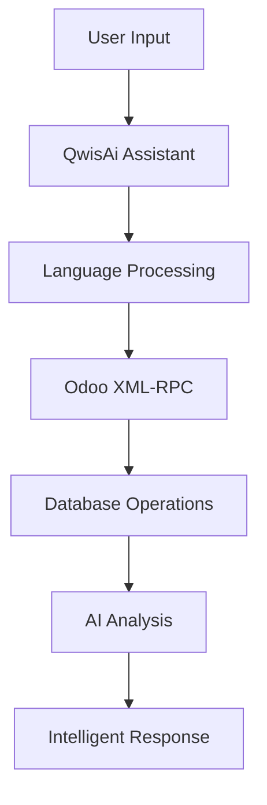

# QwisAi Assistant - Intelligent ERP Companion

> **Transform your business operations** with advanced AI technology that converts complex ERP tasks into simple conversations.

[](https://www.odoo.com)
[](https://python.org)
[](https://fastapi.tiangolo.com)
[](https://anthropic.com)

---

## **Why QwisAi Assistant?**

Imagine controlling your entire Odoo system through natural conversation - asking questions, getting insights, and executing operations as easily as chatting with a colleague. QwisAi Assistant makes this vision a reality.

### **Core Capabilities**

#### **Global Communication**
- **Arabic Excellence**: Native Arabic support with cultural business context
- **English Mastery**: Professional business English communication
- **French Fluency**: Complete French language integration
- **Smart Detection**: Automatic language recognition and adaptation

#### **Business Intelligence**
- **Strategic Consulting**: Expert business advice beyond technical operations
- **Market Insights**: AI-driven recommendations for growth
- **Performance Analytics**: Intelligent data interpretation
- **Predictive Guidance**: Future-focused business strategies

#### **Operational Excellence**
- **Natural Language Processing**: Speak to your ERP in plain language
- **Real-time Synchronization**: Instant data updates across all modules
- **Smart Validation**: AI-powered error prevention and correction
- **Responsive Design**: Seamless experience across all devices

## **Quick Start Guide**

### **Step 1: Environment Configuration**

Secure your credentials with environment variables:

```bash
# Copy the environment template
cp .env.example .env

# Configure your settings
vim .env  # or use your preferred editor
```

**Required Configuration:**
```env
# Odoo Connection
ODOO_URL=http://localhost:8069
ODOO_DB=your_database_name
ODOO_USERNAME=your_username
ODOO_PASSWORD=your_secure_password

# AI Engine
ANTHROPIC_API_KEY=your_anthropic_api_key
```

> **Security First**: All credentials are encrypted and never logged

### **Step 2: Launch the Agent**

```bash
# Navigate to the AI agent directory
cd ai_agent

# Start the intelligent assistant
python -m uvicorn app:app --host 0.0.0.0 --port 8000 --reload
```

**Access your AI assistant at:** `http://localhost:8000`

## **How QWISAI Agent Works**

**The Magic Behind the Conversation:**


QWISAI Agent seamlessly bridges human language with Odoo's technical complexity through:
- **XML-RPC Integration**: Direct, secure connection to your Odoo database
- **Anthropic Claude AI**: Advanced natural language understanding
- **Real-time Processing**: Instant data retrieval and updates
- **Smart Validation**: Automatic error checking and prevention

---

## **Experience the Difference**

### **Strategic Business Consulting**

**Arabic Business Strategy:**
```arabic
User: "What is the best strategy to improve sales in the Saudi market?"
QWISAI: Provides comprehensive strategies tailored to the local market with competitor analysis and growth recommendations...
```

**English Market Analysis:**
```english
User: "How can I optimize my inventory management for Q4?"
QWISAI: Provides data-driven insights with seasonal trends, demand forecasting, and optimization strategies...
```

**French Operations Consulting:**
```french
User: "Comment améliorer l'efficacité de mon équipe commerciale?"
QWISAI: Offre des recommandations personnalisées basées sur les meilleures pratiques...
```

### **Seamless Technical Operations**

**Data Intelligence:**
```bash
# Natural language queries
"Show me top 10 customers by revenue"
"List products with low stock levels"
"Show me pending sales orders"
```

**Real-time Updates:**
```bash
# Conversational data management
"Update customer ABC's credit limit to $50,000"
"Add 100 units to product XYZ inventory"
"Update order status to confirmed"
```

**Module Management:**
```bash
# Intelligent module operations
"Install HR management module"
"Activate accounting module"
"Show all available modules"
```

---

## **Advanced Intelligence Features**

### **Smart Context Recognition**
```python
# AI automatically detects intent
Consultation Query → Strategic Business Advice
Technical Query → Direct Odoo Operations
Mixed Query → Balanced Response
```

### **Enhanced Data Visualization**
- **Professional Formatting**: Clean, structured output with visual separators
- **Multilingual Labels**: Arabic/English field names for global teams
- **Smart Truncation**: Optimized display for large datasets
- **Rich Formatting**: Icons, emojis, and color-coded responses

### **Enterprise-Grade Reliability**
- **Auto-Recovery**: Intelligent error handling with retry mechanisms
- **Deep Validation**: AI-powered data integrity checks
- **Connection Resilience**: Robust network failure handling
- **Smart Alerts**: Proactive issue detection and resolution

---

## **Why Choose QwisAi Assistant?**

| Feature | Traditional ERP | QwisAi Assistant |
|---------|----------------|---------------|
| **Language Support** | Limited | Arabic, English, French |
| **Query Method** | Complex menus | Natural conversation |
| **Learning Curve** | Weeks/Months | Immediate |
| **Data Insights** | Manual reports | AI-powered analytics |
| **User Experience** | Technical | Intuitive & friendly |

---

## **Technical Excellence**

### **Architecture Overview**


### **Architecture Stack**
```yaml
Backend:
  Framework: FastAPI (Python 3.12+)
  AI Engine: Anthropic Claude API
  Integration: XML-RPC Protocol
  
Frontend:
  Technology: Modern HTML5/CSS3/JavaScript
  Design: Responsive & Mobile-First
  
Infrastructure:
  Database: PostgreSQL (via Odoo)
  Server: Uvicorn ASGI
  Security: Enterprise-grade encryption
```

### **API Reference**

| Endpoint | Method | Purpose |
|----------|--------|-----------|
| `/chat` | POST | Main conversation interface |
| `/context` | GET | Odoo system information |
| `/ping` | GET | Health monitoring |
| `/clear-cache` | POST | Cache management |

### **API Endpoints**

```python
# Core Communication
POST /api/v1/query
{
    "input": "Show me today's sales",
    "language": "en",
    "context": "sales_report"
}

# Response
{
    "result": "Today's sales total $15,420 across 23 orders...",
    "data": {...},
    "suggestions": ["View detailed breakdown", "Compare with yesterday"]
}
```

### **Security & Compliance**

- **End-to-End Encryption**: All communications secured
- **Role-Based Access**: Respects Odoo permissions
- **Audit Trails**: Complete interaction logging
- **GDPR Compliant**: European data protection standards
- **API Security**: OAuth 2.0 and JWT tokens

---

## **Get Started Today**

> **Transform your Odoo experience in minutes, not months.**

### **Installation Commands**
```bash
# Clone the repository
git clone https://github.com/abdelouafitahiri/odoo_ai_agent

# Install dependencies
pip install -r requirements.txt

# Configure environment
cp .env.example .env
# Edit .env with your settings
```

**Ready to revolutionize your ERP experience?**
